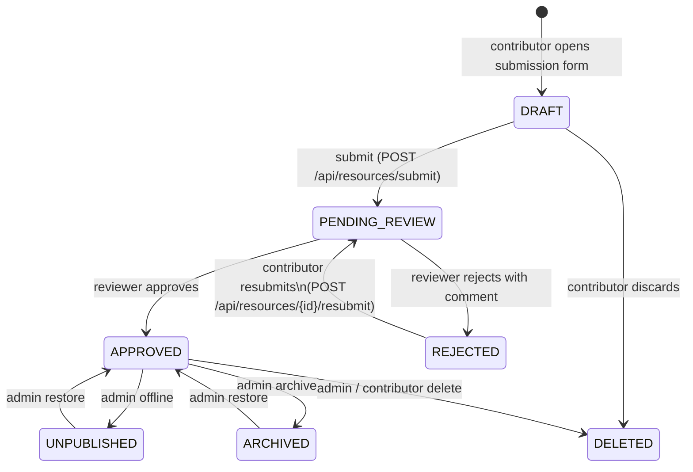
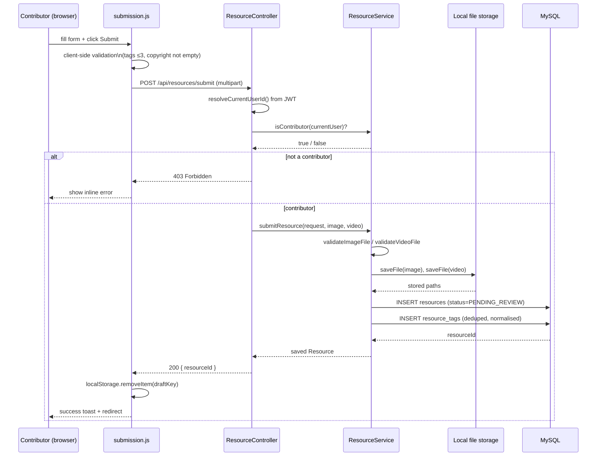
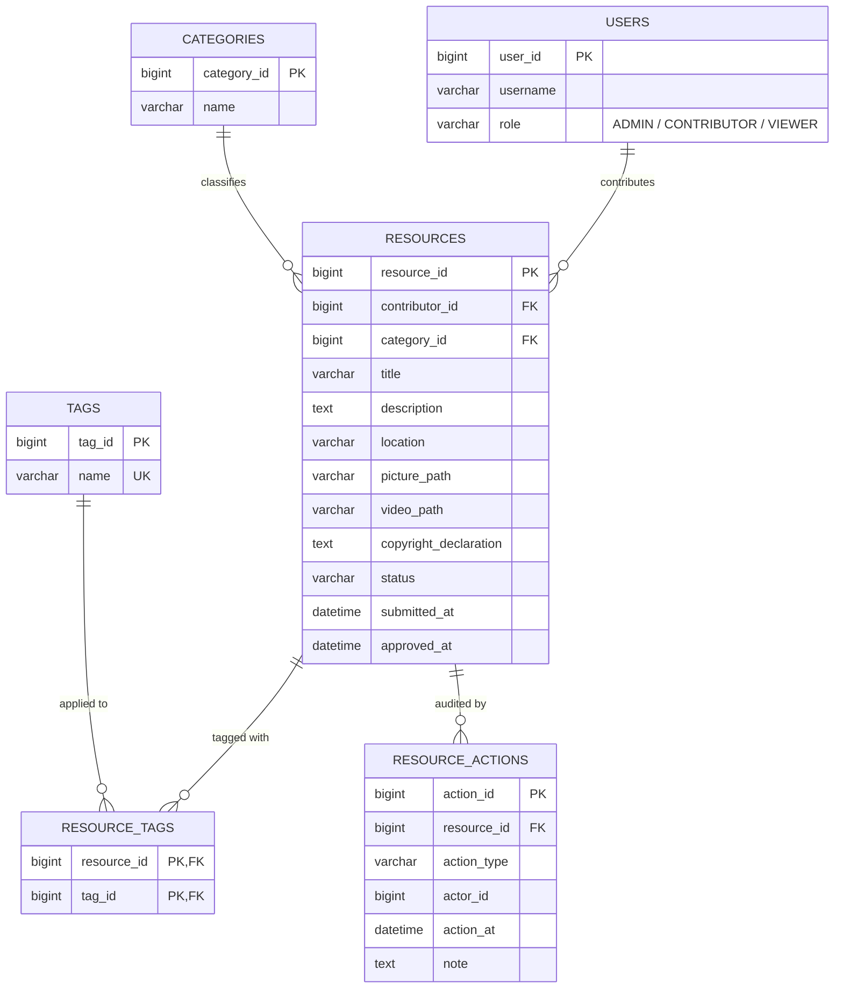

# Section 2 / Appendix — Diagrams (Mermaid sources)

> These diagrams are derived from the actual code under
> `src/main/java/.../controller/ResourceController.java`,
> `src/main/java/.../service/ResourceService.java`,
> `src/main/java/.../entity/Resource.java`, and
> `src/main/resources/static/js/submission.js`.
>
> Render each block at https://mermaid.live and export as PNG/SVG for
> insertion into the report.

---

## Figure A.6 — Resource lifecycle (state diagram, supports PBI4 + PBI5)



What to say in the text:
- "Figure A.6 captures the canonical state machine implemented by the
  `ResourceStatus` enum and enforced in `ResourceService`. Only the
  transitions `DRAFT → PENDING_REVIEW` and `REJECTED → PENDING_REVIEW`
  fall within the submission module I own; the remainder are exercised
  by the reviewer and admin modules but constrain the contract my code
  must respect."

---

## Figure B.1 — Sequence diagram for PBI4 (formal submission)



What to say in the text:
- "Figure B.1 traces a successful submission from the browser to MySQL.
  Note the three guard points before any state-changing call: JWT
  resolution, role check, and per-file validation. This layered guard
  pattern is reused in the resubmission flow."

---

## Figure B.2 — Activity diagram for PBI5 (copyright declaration & file validation)

```mermaid
flowchart TD
    A([Start: user submits form]) --> B{copyrightDeclaration<br/>non-blank?}
    B -- no --> R1([Reject 400:<br/>"Copyright declaration is required"])
    B -- yes --> C{image present?}
    C -- no --> R2([Reject 400:<br/>"Image is required"])
    C -- yes --> D{image MIME in<br/>allowed set?}
    D -- no --> R3([Reject 400:<br/>"Unsupported image type"])
    D -- yes --> E{image size<br/>≤ 10 MB?}
    E -- no --> R4([Reject 400:<br/>"Image too large"])
    E -- yes --> F{video present?}
    F -- no --> G[continue with image-only]
    F -- yes --> H{video MIME + size OK?}
    H -- no --> R5([Reject 400:<br/>"Unsupported / too-large video"])
    H -- yes --> G
    G --> I[persist Resource<br/>status = PENDING_REVIEW]
    I --> J([End: return resourceId])
```

What to say in the text:
- "Figure B.2 makes explicit the short-circuit validation order used in
  `ResourceService.validateImageFile / validateVideoFile`. Ordering
  cheap structural checks before the expensive disk-write avoids
  half-written files on disk when the request would have been rejected
  anyway."

---

## Figure E.1 — ERD slice relevant to the submission module



What to say in the text:
- "Figure E.1 shows the subset of the schema touched by the submission
  flow. Two design decisions are worth flagging: (i) tags use a
  many-to-many junction (`RESOURCE_TAGS`) rather than a CSV column so
  that the discovery module can filter by tag without `LIKE` scans; and
  (ii) every status transition is also recorded in `RESOURCE_ACTIONS`,
  giving administrators an immutable audit trail independent of the
  current `status` column."
